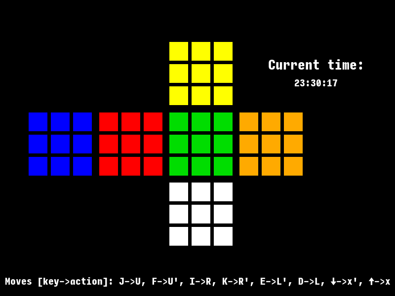
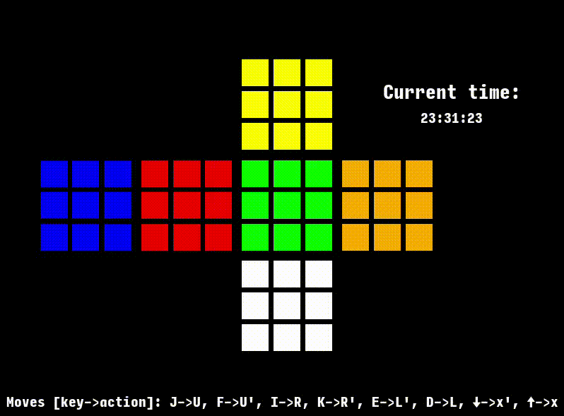

# Zen 2D Rubik's cube

Zen 2D Rubik's cube is a GUI interactivee virtual 2D Rubik's cube for zen-like solving. Done using Golang and SDL2.

You can train algorithms or just play around with a virtual cube. No pressure no timer, go fullscreen for max zen and scramble the cube in peace. With the clock in the corner you'll know whenever it's the time to end.



# Download
To download this project use the *git clone* command from the terminal:
```bash
$ git clone https://github.com/Sanubir/Zen-2D-Rubiks-cube.git
```
or use the "Download ZIP" option from the [Github](https://github.com/Sanubir/Zen-2D-Rubiks-cube) page and extract the files once downloaded.

# Requirements
 * [Go](https://go.dev/)
 * [SDL2](https://github.com/veandco/go-sdl2/) (specifically the Golang wrapper)

Install the above per their documentation.

To check if Golang is installed run the this from the terminal:
```bash
$ go version
```

Next install SDL2 for Golang:
```bash
$ go get github.com/veandco/go-sdl2/
```
After that you are good to go.

# Quick Setup
Run the project by 'cd-ing' into the *Zen-2D-Rubiks-cube/* directory and using the *go* command from the terminal:
```bash
$ cd Zen-2D-Rubiks-cube/
$ go run main.go
```
Please keep in mind that the first use of SDL2 might take a while to compile and run.

If there are errors about fonts you might also have to install SDL2 ttf devel packages.

On Fedora run:
```bash
$ sudo dnf install SDL2_ttf-devel
```
On Ubuntu run:
```bash
$ sudo apt-get install libsdl2-ttf-dev
```

That's mostly it, hope you enjoy it.

# Example of a R, U, R', U' algorithm


_Please notice that this repository is a temporary showcase, which should be polished within the next days._
